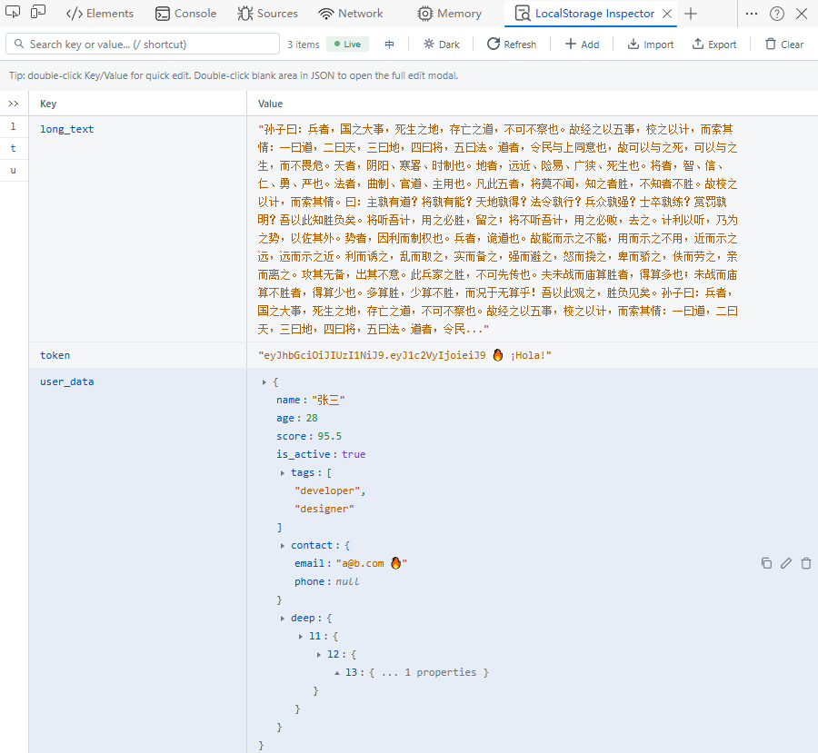
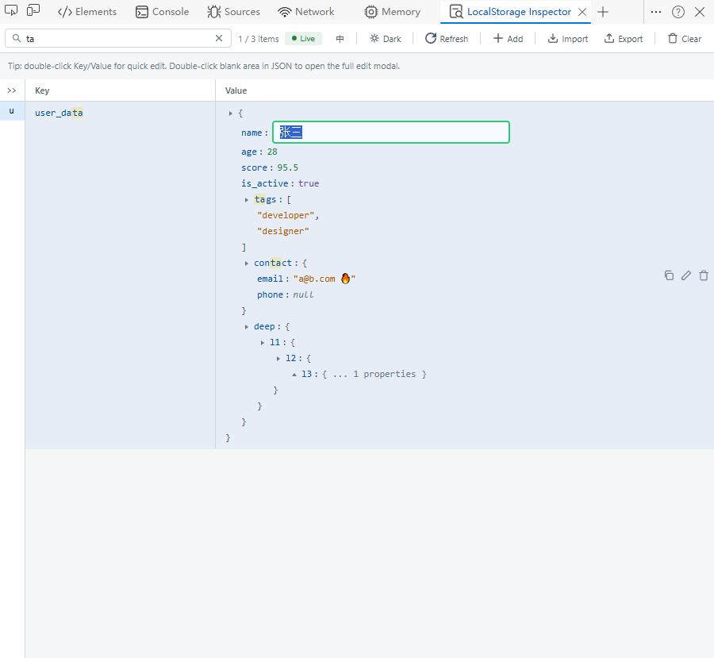
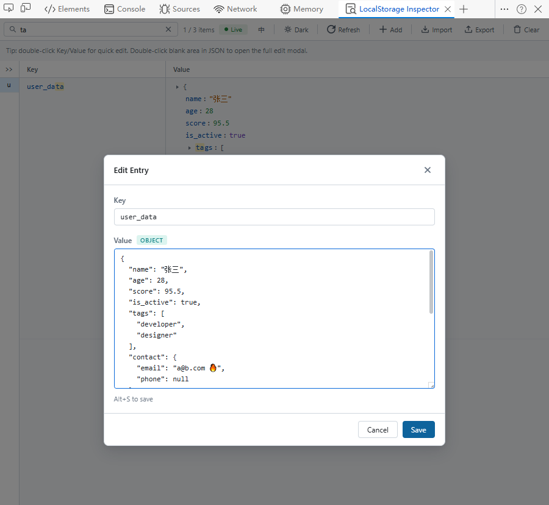
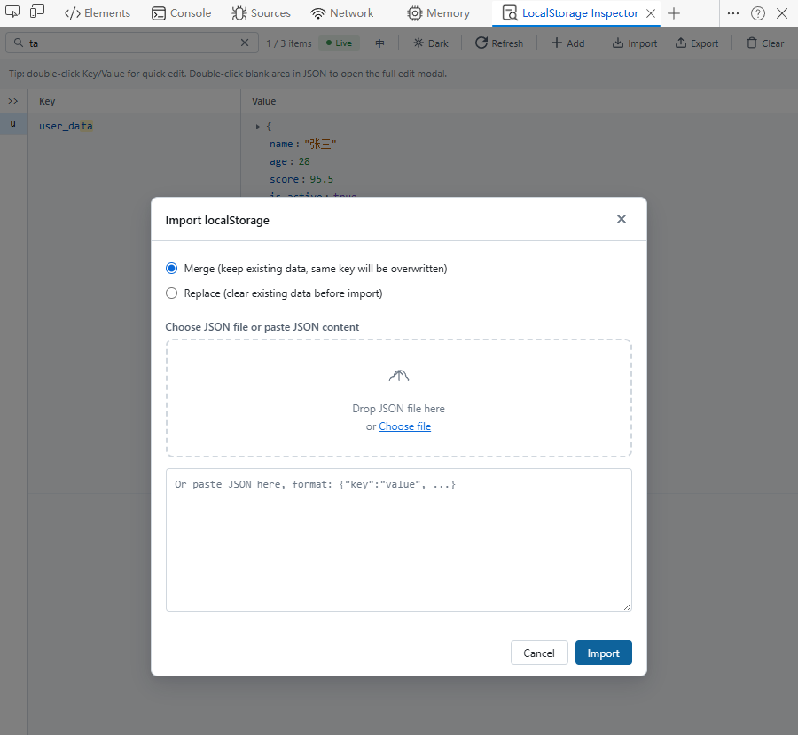

# LocalStorage Inspector

**A Chrome DevTools extension for visualizing and editing `localStorage` data**

English · [简体中文](README.md)

## 📦 Features

- Dedicated DevTools panel to view all `localStorage` data of the current page
- Search & filter by `key` or `value` with entry count display
- Add, edit, delete individual entries, and clear all data with confirmation
- JSON values displayed as a collapsible tree with nested editing support
- Import / Export JSON (import supports `merge` and `replace` modes)
- One-click copy value (JSON gets auto-formatted)
- Live monitoring (polling) + manual refresh
- Theme switching (Dark / Light)
- English / Chinese language switching
- Key index sidebar for quick navigation
- Keyboard shortcuts:
  - `Alt+N` — Add new entry
  - `Alt+S` — Save in edit modal
  - `/` — Focus search box

## 📸 Screenshots

### Overview

### Search & Inline Edit

### Edit KV

### Import

## 🚀 Installation (Developer Mode)

> Works with Chrome / Edge (Chromium-based, version ≥ 105 recommended).

1. Download or clone this repository
2. Open the extensions management page:
   - Chrome: `chrome://extensions/`
   - Edge: `edge://extensions/`
3. Enable **Developer mode**
4. Click **Load unpacked**
5. Select the project root directory (the one containing `manifest.json`)
6. Open any webpage, press `F12` to open DevTools, and find the **LocalStorage Inspector** tab

## 🛠️ Tech Stack

- **Manifest V3** — Latest extension specification
- Vanilla JavaScript + HTML + CSS — No external dependencies

## 🤝 Contributing

Issues and Pull Requests are welcome!

## 📄 License

This project is licensed under the MIT License.
