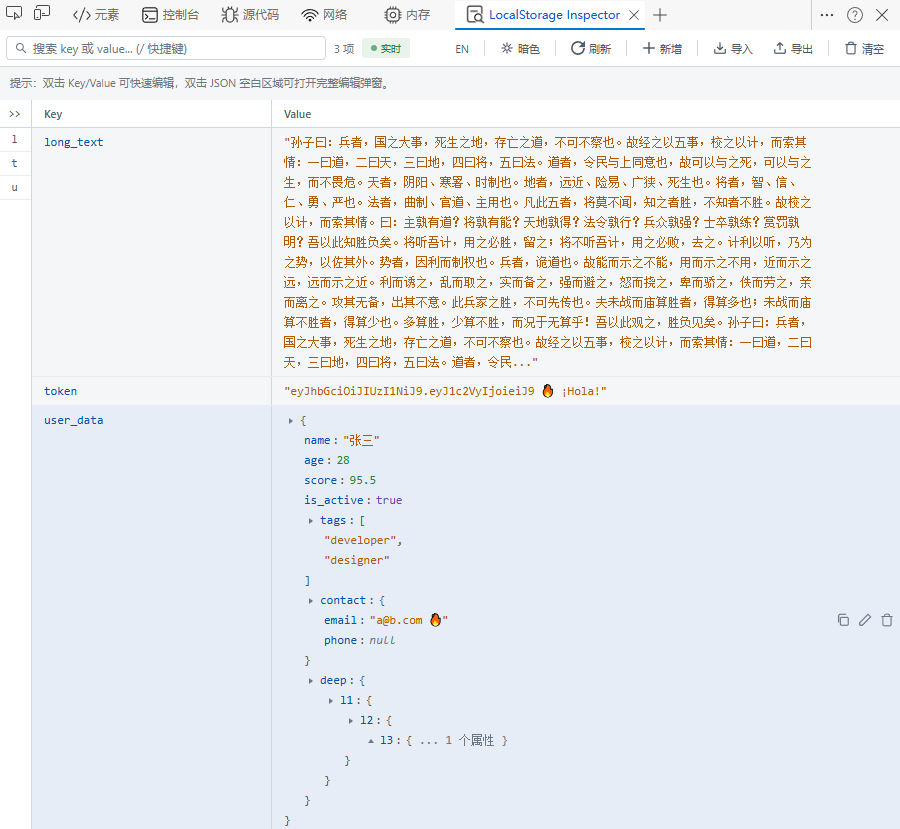
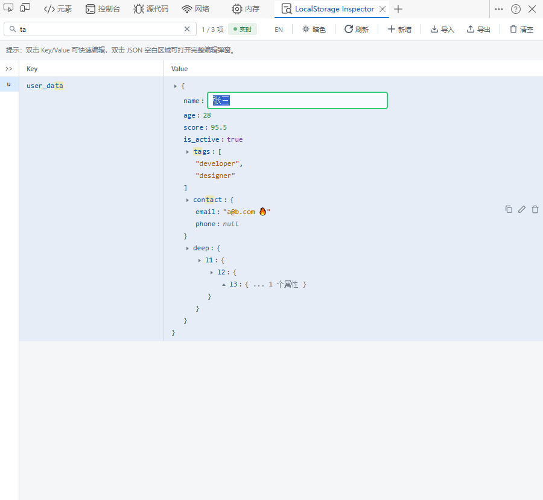
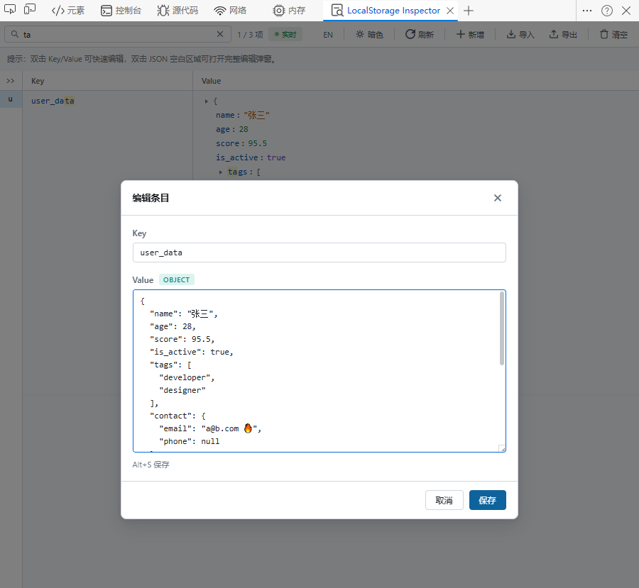
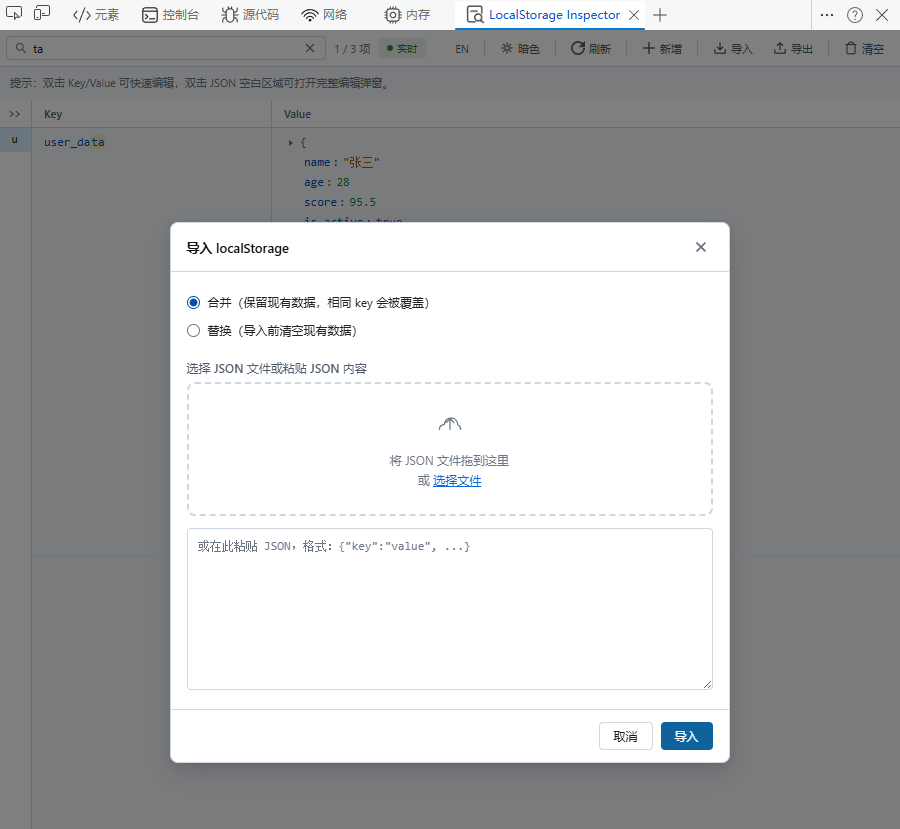

# LocalStorage Inspector

**一个 Chrome DevTools 扩展，用于可视化查看与编辑 `localStorage` 数据**

[English](README.en.md) · 简体中文

## 📦 功能简介

- DevTools 独立面板，集中查看当前页面的 `localStorage` 数据
- 按 `key` / `value` 搜索与过滤，并显示条目数量
- 新增、编辑、删除单条数据，一键清空全部数据（带确认）
- JSON 值的树形展示、展开/折叠与嵌套内容编辑
- 导入 / 导出 JSON（导入支持 `merge` 与 `replace` 两种模式）
- 一键复制值内容（JSON 自动格式化）
- 实时监控（轮询刷新）+ 手动刷新
- 主题切换（深色 / 浅色）
- 中英文切换
- Key 索引侧栏，快速定位条目
- 快捷键：
  - `Alt+N` — 新增条目
  - `Alt+S` — 在编辑弹窗中保存
  - `/` — 快速聚焦搜索框

## 📸 截图预览

|                    概览                     |                             搜索与内联编辑                              |
|:-------------------------------------------:|:-----------------------------------------------------------------------:|
|  |  |

|                 编辑 KV                 |                  导入                   |
|:---------------------------------------:|:---------------------------------------:|
|  |  |

## 🚀 安装方式（开发模式）

> 适用于 Chrome / Edge（Chromium 内核，建议版本 ≥ 105）

1. 下载或克隆本项目到本地
2. 打开浏览器扩展管理页：
   - Chrome：`chrome://extensions/`
   - Edge：`edge://extensions/`
3. 打开 **开发者模式**
4. 点击 **加载已解压的扩展程序（Load unpacked）**
5. 选择本项目根目录（即包含 `manifest.json` 的目录）
6. 打开任意网页，按 `F12` 打开 DevTools，在顶部面板中找到 **LocalStorage Inspector**

## 🛠️ 技术栈

- **Manifest V3** — 最新扩展规范
- 原生 JavaScript + HTML + CSS — 无需额外依赖

## 🤝 贡献

欢迎提交 Issue 或 Pull Request！

## 📄 许可

本项目基于 MIT 许可证开源。
